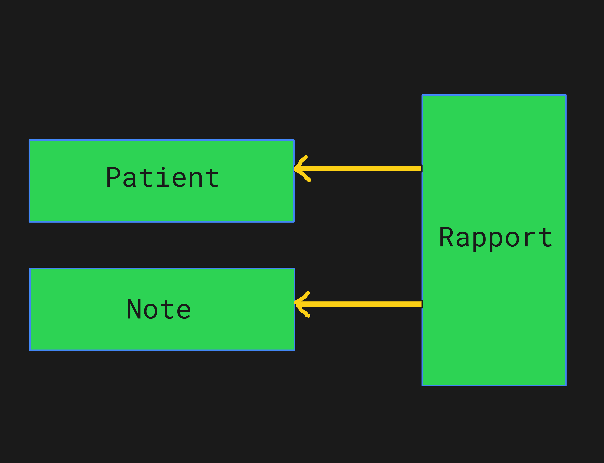

<h1>Mediscreen application and Microservices</h1>


Java / Spring Boot / Angular / Docker


<h2> Diagram </h2>

<p align="center">
  
</p>


Requirements : <br/>


<h2>Endpoints Microservices & Documentations Swagger UI</h2>

patient : http://localhost:8081/swagger-ui/index.html#
<br/>
note : http://localhost:8082/swagger-ui/index.html#
<br/>
rapport : http://localhost:8083/swagger-ui/index.html#


1 -  to set up Angular application, go into mediscreen-front and tape:

```bash
npm install
```

2 -  and to launch the front end server, tape:

```bash
ng serve --open
```
